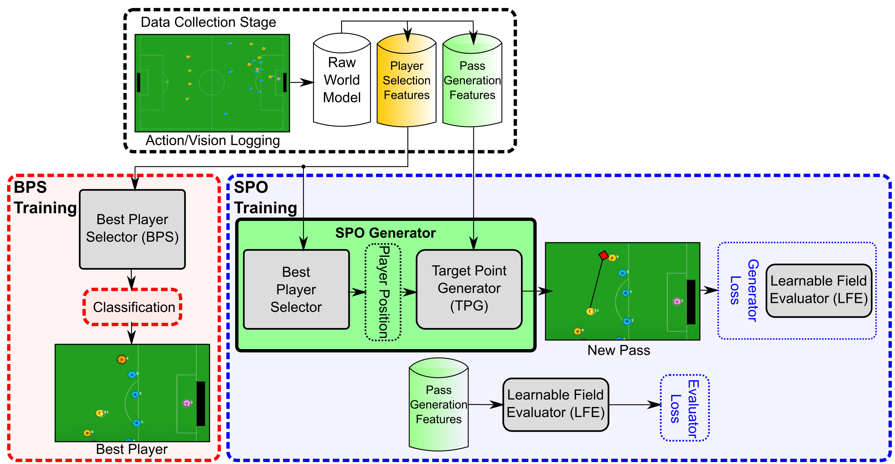

---
<h1 style="text-align: center;">RobôCIn2D - SPO</h1>


Single Pass Optimization genearting MLP model for single-step target point generation for passing in Soccer Simulation 2D.

Requirements:

- conda
- download [the dataset](https://drive.google.com/file/d/1Bh6hnAocPXlCejJNrYyYFHXOUuBdwwuF/view?usp=sharing) used in the paper.
- download [the BPS model](https://drive.google.com/file/d/15XhGUtJNh6kO7YdMDU3EkmJlt4bNinnm/view?usp=sharing) used in the paper and place it inside a `models` folder.




### How to setup SPO:

```
    >> install and activate the environment
    conda env create -f ./environment.yaml
    conda activate spo

    >> unpack the dataset used in the paper
    unzip ./db.zip -d ./
```

### Model configuration

To configure the model, modify the `hparams.yaml` file.

### Train

Note: to reduce training time, the training is not memory-optimized. Thus, a system with higher memory may be required.


```
    >> to generate a new BPS model:
    python train_cyrus.py train

    >> run the SPO training
    python train.py 
```